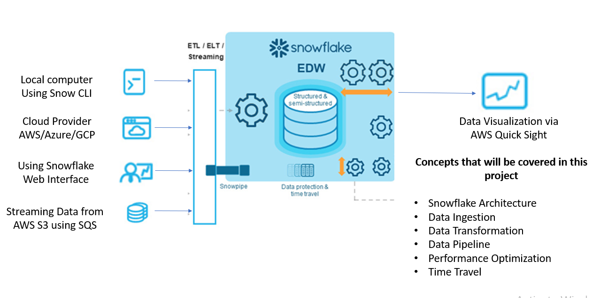

## Objective
Objective of this project is to getting started in an handson way with snowflake and AWS. Following will be the objectives of this project based learnings

- Overview of Snowflake
- Loading data into snowflake using Web UI
- Loading data into Snowflake using Snow CLI
- Loading data int0 snowflake from S3 using Access/Private keys
- Loading data into snowflake from S3 using Storage Integration
- Loading Real-time data into snowflake using Snowpipe
- Visualaizing the loadded data via AWS QuickSIght
- Understanding pricing of Snowflake
- Time Travel in Snowflake
- Performance optimization in Snowflake



## Prerequisites
- A Snowflake account with an active warehouse and appropriate roles/privileges.
- Install `snowsql` (Snowflake CLI) if you want to run commands locally.
- If loading from S3: an AWS account, `aws` CLI (optional), S3 bucket and credentials or an IAM role configured for Snowflake.

## Tech Stack
- Languages: SQL
- Services: Snowflake, SnowSQL, Amazon S3 (optional), QuickSight (optional)

## Contents

```
snowflake-loading-data/
├── README.md                          # This file with all instructions and examples
├── snowflake-laoding.sql              # Main SQL script with all examples
├── s3 policy.txt                      # AWS S3 bucket policy template
├── trust-policy.txt                   # AWS IAM trust policy template
├── data/                              # Sample CSV files for loading
│   ├── customer_detail.csv            # Customer data sample (pipe-delimited)
│   ├── TSLA.csv                       # Tesla stock data sample
│   └── TSLAmodified.csv               # Modified Tesla stock data
└── img/                               # Images and diagrams
	└── flow.png                       # Snowflake data loading flow diagram
```

**File Descriptions:**
-- `snowflake-laoding.sql` — example SQL and SnowSQL commands demonstrating table creation, stages, COPY, storage integration, Snowpipe and time travel.
- `data/` — sample CSV files used by examples (e.g., `customer_detail.csv`, `TSLA.csv`).
- `img/` — illustrative images showing the data loading flow.
- `s3 policy.txt` — AWS S3 bucket policy to grant Snowflake access to your S3 bucket.
- `trust-policy.txt` — AWS IAM trust policy for the Snowflake service role.

## Prerequisites
- A Snowflake account with an active warehouse and appropriate roles/privileges.
- Install `snowsql` (Snowflake CLI) if you want to run commands locally.
- If loading from S3: an AWS account, `aws` CLI (optional), S3 bucket and credentials or an IAM role configured for Snowflake.

## Getting started with Hands-on

### ❄️ Overview of Snowflake:

Snowflake is a cloud-native data platform designed for scalable storage, compute separation, and elastic SQL processing. For data engineering use cases Snowflake is commonly used to ingest, transform, and serve data for analytics and downstream applications. Key ideas:

- Data is organized in `DATABASE`s and `SCHEMA`s for logical separation.
- `WAREHOUSE`s provide the compute resources to run queries; they can auto-scale, suspend, and resume.
- `ROLE`s and `USER`s control access and privileges; follow least-privilege practices for production.

Below are short definitions and example SQL for common Snowflake concepts used in data engineering.

- Database: a top-level logical container for schemas and objects. Example:

```sql
CREATE DATABASE SNOWFLAKE_LOADING_DB;
USE DATABASE SNOWFLAKE_LOADING_DB;
```

- Schema: a namespace inside a database that groups tables, views and other objects. Example:

```sql
CREATE SCHEMA SNOWFLAKE_LOADING_SCHEMA;
USE SCHEMA SNOWFLAKE_LOADING_SCHEMA;
```

- Role: defines a set of privileges. Assign roles to users and grant privileges to roles. Example:

```sql
CREATE ROLE SNOWFLAKE_LOADING_ROLE;
GRANT USAGE ON DATABASE SNOWFLAKE_LOADING_DB TO ROLE SNOWFLAKE_LOADING_ROLE;
GRANT USAGE ON SCHEMA SNOWFLAKE_LOADING_DB.SNOWFLAKE_LOADING_SCHEMA TO ROLE SNOWFLAKE_LOADING_ROLE;
GRANT SELECT, INSERT ON ALL TABLES IN SCHEMA SNOWFLAKE_LOADING_DB.SNOWFLAKE_LOADING_SCHEMA TO ROLE SNOWFLAKE_LOADING_ROLE;
-- Grant role to a user (requires ACCOUNTADMIN or SECURITYADMIN)
GRANT ROLE SNOWFLAKE_LOADING_ROLE TO USER alice;
```

- User: an account-level identity. Create users for service accounts or team members. Example:

```sql
CREATE USER ETL_USER
	PASSWORD = 'ChangeMe123!' -- rotate in production
	DEFAULT_ROLE = SNOWFLAKE_LOADING_ROLE
	DEFAULT_WAREHOUSE = COMPUTE_WH;
```

- Warehouse: the compute resource that executes queries. Size and auto-suspend control cost/latency. Example:

```sql
CREATE WAREHOUSE compute_wh
	WAREHOUSE_SIZE = 'XSMALL'
	AUTO_SUSPEND = 300
	AUTO_RESUME = TRUE
	INITIALLY_SUSPENDED = TRUE;
USE WAREHOUSE compute_wh;
```

These small examples are safe to run in a development account; for production, replace passwords with secrets management and create more granular roles and resource monitors.

### 🌐 Loading data into snowflake using Web UI

Create the require table for laoding data into that table.

```sql
USE DATABASE SNOWFLAKE_LOADING_DB;
USE SCHEMA SNOWFLAKE_LOADING_SCHEMA;

CREATE TABLE CUSTOMER_DETAILS (
	first_name STRING,
	last_name STRING,
	address STRING,
	city STRING,
	state STRING
);
SELECT * FROM CUSTOMER_DETAILS;
```

- Goto snowflake and from side menu select ingestion icon and then `Add Data`
- Select `Load data into a Table`
- Browse and load the `data/customer_detail.csv` file into CUSTOMER_DETAILS table
- Make sure to select.
	- CSV as file format
	- PIPE as seperator
	- First file as header

### ⌨️ Loading data into Snowflake using Snow CLI

- Make sure to install Snow CLI using [https://sfc-repo.snowflakecomputing.com/snowflake-cli/index.html](https://sfc-repo.snowflakecomputing.com/snowflake-cli/index.html)

- Launch your terminal (Git Bash, PowerShell, or macOS/Linux terminal) and verify installation

```bash
snow --version
```
- Execute the following commands to add a new connection.

```bash
snow connection add
```
When prompted, provide the required details such as: Connection name, Account identifier, Username, Authentication method (password, SSO, key-pair, etc.) and any optional parameters (role, warehouse, database, schema)

- After creating the connection, verify it using

```bash
snow connection test
```

If configured correctly, you should see a success message confirming the connection.

- Create a file format and stage, then `PUT` the file and `COPY INTO` the table. Example commands (run inside `snowsql` or as script lines where appropriate):

```sql
CREATE OR REPLACE FILE FORMAT PIPE_FORMAT_CLI
	TYPE = 'CSV'
	FIELD_DELIMITER = '|'
	SKIP_HEADER = 1;

CREATE OR REPLACE STAGE PIPE_CLI_STAGE
	FILE_FORMAT = PIP_FORMAT_CLI;
```

- Then from your shell (or in `snowsql` with a local client path) to copy data from local to stage suing file format we created above:

```bash
PUT file:///workspaces/snowflake-loading-data/data/customer_detail.csv @PIPE_CLI_STAGE AUTO_COMPRESS=TRUE;
```

- To copy teh data from stage to main table need to run the following copy command

```sql
-- copying data froms tage to table
COPY INTO CUSTOMER_DETAILS
FROM @PIPE_CLI_STAGE
FILE_FORMAT=(format_name=PIPE_FORMAT_CLI)
ON_ERROR='skip_file';

-- verify the table loading
SELECT COUNT(*) FROM CUSTOMER_DETAILS;
```

### 🔑 Loading data into snowflake from S3 using Access/Private keys

- Upload the file to your S3 bucket and create an external stage or use credentials in the `CREATE STAGE` statement. Example (replace placeholders):

```sql
-- creating table
CREATE OR REPLACE TABLE TESLA_STOCKS(
	date DATE,
	open_value DOUBLE,
	high_vlaue DOUBLE,
	low_value DOUBLE,
	close_vlaue DOUBLE,
	adj_close_value DOUBLE,
	volume BIGINT
);

-- creating stage
CREATE OR REPLACE STAGE BULK_COPY_TESLA_STOCKS
	URL = 's3://your-bucket/path/TSLA.csv'
	CREDENTIALS = (AWS_KEY_ID='<access_key>', AWS_SECRET_KEY='<secret_key>');

-- loading data
COPY INTO TESLA_STOCKS
	FROM @BULK_COPY_TESLA_STOCKS
	FILE_FORMAT = (TYPE = 'CSV', FIELD_DELIMITER = ',', SKIP_HEADER = 1)
	ON_ERROR = 'skip_file';

-- verifying data
SELECT COUNT(*) FROM TESLA_STOCKS;
```

### 🔗 Loading data into snowflake from S3 using Storage Integration

- Create an IAM role and grant access as shown in `snowflake-laoding.sql`, then create a storage integration in Snowflake and reference it when creating stages. Key commands:

```sql
-- use high level of role
USE ROLE ACCOUNTADMIN;
GRANT CREATE INTEGRATION ON ACCOUNT TO SYSADMIN;
USE ROLE SYSADMIN;

-- creating S3 integration
CREATE OR REPLACE STORAGE INTEGRATION S3_INTEGRATION
	TYPE = EXTERNAL_STAGE
	STORAGE_PROVIDER = 'S3'
	STORAGE_AWS_ROLE_ARN = '<role arn>'
	ENABLED = TRUE
	STORAGE_ALLOWED_LOCATIONS = ('s3://your-bucket-prefix/');

-- grnating access to S3 integration
GRANT USAGE ON INTEGRATION S3_INTEGRATION TO ROLE SYSADMIN;
DESC INTEGRATION S3_INTEGRATION;

-- creatning stage
CREATE OR REPLACE STAGE S3_INTEGRATEION_BULK_COPY_TESLA_STOCKS
	STORAGE_INTEGRATION = S3_INTEGRATION
	URL = 's3://your-bucket-prefix/TSLA.csv'
	FILE_FORMAT = (TYPE = 'CSV', FIELD_DELIMITER = ',', SKIP_HEADER = 1);

-- copying data
COPY INTO TESLA_STOCKS 
FROM @S3_INTEGRATEION_BULK_COPY_TESLA_STOCKS;
```

### ⚡ Loading Real-time data into snowflake using Snowpipe

- High level steps from the repo:
	- Stage the data.
	- Test the `COPY` command.
	- Create a `PIPE` with `AUTO_INGEST=TRUE`.
	- Configure cloud notifications (S3 event notifications) or call the Snowpipe REST API.

Example pipe creation:

```sql
CREATE OR REPLACE PIPE S3_TESLA_PIPE
AUTO_INGEST=TRUE 
AS
COPY INTO TESLA_STOCKS FROM @S3_TESLA_STAGE;

SHOW PIPES;

SELECT * FROM TESLA_STOCKS;

DROP PIPE S3_TESLA_PIPE;
```

### 📊 Visualaizing the loadded data via AWS QuickSIght

After loading data into Snowflake, you can visualize it using AWS QuickSight for business intelligence and analytics.

- Set up QuickSight in your AWS account
- Create a new data source and connect it to your Snowflake database
- Use the Snowflake connector to authenticate with your Snowflake account
- Select the database, schema, and tables you want to visualize

Example query to use for visualization:

```sql
SELECT 
	DATE,
	OPEN_VALUE,
	CLOSE_VLAUE,
	HIGH_VLAUE,
	LOW_VALUE,
	VOLUME
FROM TESLA_STOCKS
ORDER BY DATE DESC;
```

Once connected, you can create:
- Line charts for stock price trends
- Bar charts for volume comparisons
- Dashboards combining multiple visualizations

### 💰 Understanding pricing of Snowflake

Snowflake pricing is based on compute and storage consumption:

**Compute Costs:**
- Priced per Snowflake Credit (per second of warehouse usage)
- Warehouse size determines credit consumption per second
- XSMALL = 1 credit/second, SMALL = 2 credits/second, MEDIUM = 4 credits/second, etc.
- You only pay for active warehouses; suspended warehouses don't incur compute charges

**Storage Costs:**
- Priced per TB of on-demand storage per month
- Automatic compression reduces storage footprint
- Time Travel and Fail-safe increase storage usage (additional fees apply)

**Example cost estimation:**

```
If you run an XSMALL warehouse for 1 hour (3600 seconds):
- 3600 seconds × 1 credit/second ÷ 3600 seconds/hour = 1 credit
- At ~$4 per credit (varies by region and contract), cost = ~$4

If you store 1 TB of data per month:
- Cost = 1 TB × $40 per TB/month = ~$40 (varies by region)
```

Best practices to minimize costs:
- Use AUTO_SUSPEND to pause warehouses during idle periods
- Right-size your warehouse for your workload
- Archive old data to S3 instead of keeping in Snowflake
- Monitor usage with SNOWFLAKE.ACCOUNT_USAGE views

### ⏰ Time Travel in Snowflake

Time Travel allows you to access historical versions of tables and schemas at any point within a retention period (default 1 day, up to 90 days with Enterprise Edition).

Example Time Travel queries:

```sql
-- View current state
SELECT * FROM TESLA_STOCKS ORDER BY DATE DESC;

-- Query as it was 1 hour ago
SELECT * FROM TESLA_STOCKS AT(OFFSET => -3600) ORDER BY DATE DESC;

-- Query as it was at a specific timestamp
SELECT * FROM TESLA_STOCKS BEFORE(TIMESTAMP => '2022-08-01 10:00:00') ORDER BY DATE DESC;

-- Query before a specific statement (DML operation)
SELECT * FROM TESLA_STOCKS BEFORE (statement => '<statement-id>') ORDER BY DATE DESC;

-- Recover a dropped table
DROP TABLE TESLA_STOCKS;
UNDROP TABLE TESLA_STOCKS;

-- Undo an update
UPDATE TESLA_STOCKS SET OPEN_VALUE = 200 WHERE DATE = '2022-08-01';
-- Then query before the update to see old data
SELECT * FROM TESLA_STOCKS BEFORE (statement => '<statement-id>') WHERE DATE = '2022-08-01';
```

Common use cases:
- Recovering accidentally deleted data
- Auditing data changes
- Testing data transformations
- Rolling back unintended updates

### ⚙️ Performance optimization in Snowflake

Optimize your Snowflake queries and warehouse usage for better performance and cost efficiency:

**Warehouse Optimization:**
- Choose appropriate warehouse size for your workload (start small, scale up if needed)
- Use separate warehouses for different workloads (ETL, analytics, reporting)
- Enable AUTO_SUSPEND to avoid paying for idle warehouses

**Query Optimization:**
- Use clustering on large tables (columns frequently filtered on)
- Avoid SELECT * — query only needed columns
- Use WHERE clauses to filter early in the query
- Materialized views for frequently run aggregations

Example optimized query:

```sql
-- Before: inefficient
SELECT * FROM TESLA_STOCKS;

-- After: optimized
SELECT DATE, OPEN_VALUE, CLOSE_VLAUE, VOLUME 
FROM TESLA_STOCKS 
WHERE DATE >= '2022-08-01' 
ORDER BY DATE DESC;
```

**Monitoring Performance:**

```sql
-- View query history and execution times
SELECT QUERY_ID, QUERY_TEXT, EXECUTION_TIME, CREDITS_USED 
FROM SNOWFLAKE.ACCOUNT_USAGE.QUERY_HISTORY 
WHERE EXECUTION_TIME > 60000 
ORDER BY EXECUTION_TIME DESC 
LIMIT 10;

-- Check warehouse load
SELECT WAREHOUSE_NAME, AVG_RUNNING_QUERIES, AVG_QUEUED_QUERIES 
FROM SNOWFLAKE.ACCOUNT_USAGE.WAREHOUSE_LOAD_HISTORY 
WHERE WAREHOUSE_NAME = 'COMPUTE_WH' 
ORDER BY TIMESTAMP DESC;
```

Best practices:
- Use EXPLAIN to understand query execution plans
- Partition large tables by date or other logical keys
- Keep statistics up-to-date (ANALYZE TABLE)
- Monitor warehouse utilization regularly

---